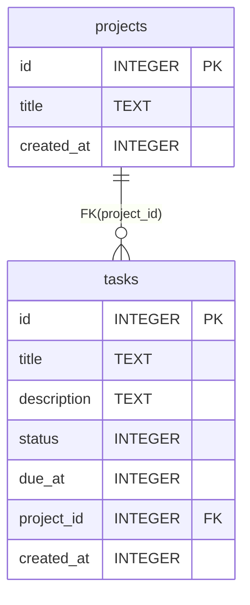

```mermaid
erDiagram
tasks {
  id INTEGER PK
  title TEXT
  description TEXT
  status INTEGER
  due_at INTEGER
  project_id INTEGER FK
  created_at INTEGER
}

projects {
  id INTEGER PK
  title TEXT
  created_at INTEGER
}

projects ||--o{ tasks : "FK(project_id)"
```