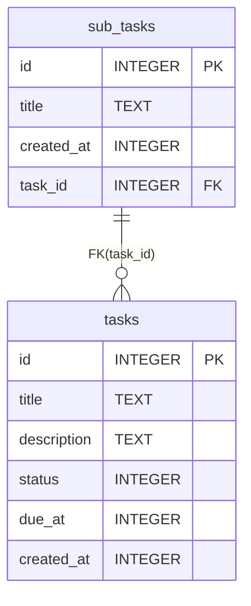

```mermaid
erDiagram
tasks {
  id INTEGER PK
  title TEXT
  description TEXT
  status INTEGER
  due_at INTEGER
  created_at INTEGER
}

sub_tasks {
  id INTEGER PK
  title TEXT
  created_at INTEGER
  task_id INTEGER FK
}

sub_tasks ||--o{ tasks : "FK(task_id)"
```