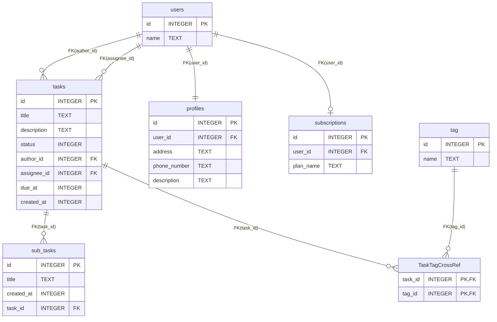

```mermaid
erDiagram
tasks {
  id INTEGER PK
  title TEXT
  description TEXT
  status INTEGER
  author_id INTEGER FK
  assignee_id INTEGER FK
  due_at INTEGER
  created_at INTEGER
}

sub_tasks {
  id INTEGER PK
  title TEXT
  created_at INTEGER
  task_id INTEGER FK
}

users {
  id INTEGER PK
  name TEXT
}

profiles {
  id INTEGER PK
  user_id INTEGER FK
  address TEXT
  phone_number TEXT
  description TEXT
}

subscriptions {
  id INTEGER PK
  user_id INTEGER FK
  plan_name TEXT
}

tag {
  id INTEGER PK
  name TEXT
}

TaskTagCrossRef {
  task_id INTEGER PK,FK
  tag_id INTEGER PK,FK
}

users ||--o{ tasks : "FK(author_id)"
users ||--o{ tasks : "FK(assignee_id)"
tasks ||--o{ sub_tasks : "FK(task_id)"
users ||--|| profiles : "FK(user_id)"
users ||--o| subscriptions : "FK(user_id)"
tasks ||--o{ TaskTagCrossRef : "FK(task_id)"
tag ||--o{ TaskTagCrossRef : "FK(tag_id)"
```